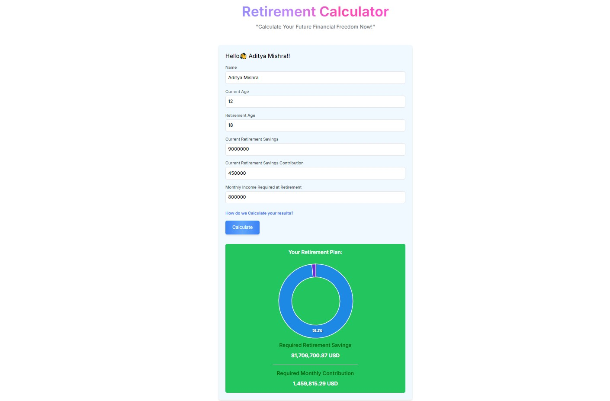

# Retirement Calculator

## Description

This retirement calculator is a simple tool built with React, Redux, and TypeScript that takes user input and calculates the amount of money you will have at retirement. It helps you estimate how much you need to save for a comfortable retirement.

## Usage

To use the retirement calculator, follow these steps:

1. Enter your name.
2. Enter your current age.
3. Enter your desired retirement age.
4. Enter your current savings amount.
5. Enter your annual contribution to your retirement savings.
6. Enter your Monthly Income Required at Retirement
7. Press the "Calculate" button.

The calculator will then display the estimated amount of money you will have at retirement based on your inputs.

## Output

## Contribution

Contributions to the retirement calculator are welcome! If you find any bugs or have suggestions for improvements, please open an issue or submit a pull request.
